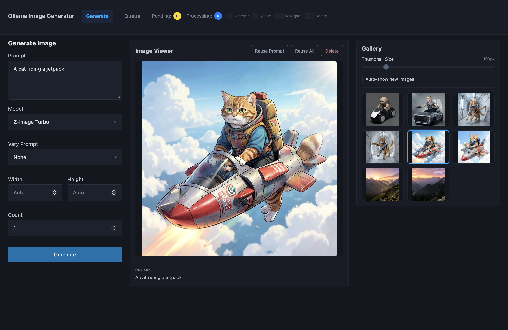

# Ollama Image Generator

A simple web interface for generating images using local Ollama models.



## Quick Start

### Prerequisites

- [Ollama](https://ollama.ai) installed and running
- Python 3.8 or newer

### Setup

1. **Create a virtual environment:**
   ```bash
   python3 -m venv .venv
   ```

2. **Activate the virtual environment:**
   ```bash
   source .venv/bin/activate  # On Windows: .venv\Scripts\activate
   ```

3. **Install dependencies:**
   ```bash
   pip install -r requirements.txt
   ```

4. **Start the server:**
   ```bash
   python3 run.py
   ```

5. **Open your browser:**
   ```
   http://localhost:8000
   ```

That's it! You should see the image generation interface.

## How to Use

1. Enter a text prompt (e.g., "a cat wearing a hat")
2. Choose your image size
3. Click "Generate"
4. Watch the progress bar as your image is created
5. View your generated images in the gallery below

## Adding More Models

To use different Ollama models, edit the `AVAILABLE_MODELS` list in `app/config.py` and restart the server.

## Troubleshooting

- **"No models available"**: Make sure Ollama is running and you have image generation models installed
- **Port already in use**: Another app is using port 8000. Stop it or change the port in `run.py`
- **Images not generating**: Check that your Ollama models are properly installed with `ollama list`
